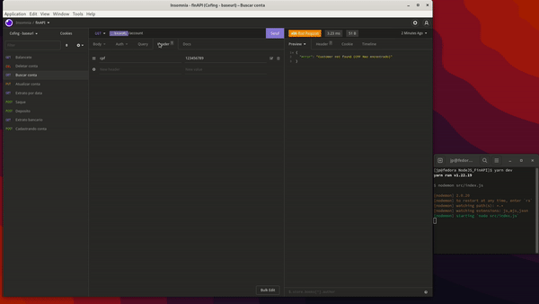

## [PT-BR] 💰 NodeJS_FinAPI  | projeto back-end desenvolvido ao decorrer do curso da rocketseat[ignite]

<h3>🚀 Tecnologias utilizadas </h3>
<ul>
  <li> NodeJS </li>
  <li> Express.js </li>
  <li> uuid </li>
</ul>

## ℹ️  Sobre o projeto 

<ul>
  <li>Projeto de uma API financeira desenvolvida apenas back-end com intuito de simular operações cotidianas.
  </li>
  <li>Simulando banco de dados na variavel customers[]</li>
  
</ul>

## 🔨 Operações & ⚙️ Configurações

<table>
    <thead>
        <th>Método</th>
        <th>URL</th>
        <th>Descrição</th>
        <th>Conteudo a enviar no header</th>
        <th>Conteudo a enviar via query (URL)</th>
        <th>Conteudo a enviar no body (JSON)</th>
    </thead>
    <tbody>
        <tr>
            <td>POST</td>
            <td>http://localhost:3333/account</td>
            <td>Criar uma conta</td>
            <td></td>
            <td></td>
            <td>
                { 
                    "cpf": "123456789", 
                    "name": "João Pedro Dev." 
                } 
            </td>
        </tr>
        <tr>
            <td>GET</td>
            <td>http://localhost:3333/statement</td>
            <td>Busca o extrato bancário do cliente</td>
            <td>cpf | 123456789</td>
            <td></td>
            <td></td>
        </tr>
        <tr>
            <td>POST</td>
            <td>http://localhost:3333/deposit</td>
            <td>Realiza um depósito</td>
            <td>cpf | 123456789</td>
            <td></td>
            <td>
                { 
                    "description": "PIX", 
                    "amount": 3500.50 
                } 
            </td>
        </tr>
        <tr>
            <td>POST</td>
            <td>http://localhost:3333/withdraw</td>
            <td>Realiza um saque</td>
            <td>cpf | 123456789</td>
            <td></td>
            <td>
                { 
                    "amount": 100.25 
                } 
            </td>
        </tr>
        <tr>
            <td>GET</td>
            <td>http://localhost:3333/statement/date</td>
            <td>Busca o extrato bancário do cliente por data</td>
            <td>cpf | 123456789</td>
            <td>date = 2022-10-05</td>
            <td></td>
        </tr>
        <tr>
            <td>PUT</td>
            <td>http://localhost:3333/account</td>
            <td>Atualiza dados da conta</td>
            <td>cpf | 123456789</td>
            <td></td>
            <td>
                { 
                    "name": "Joao" 
                } 
            </td>
        </tr>
        <tr>
            <td>GET</td>
            <td>http://localhost:3333/account</td>
            <td>Busca dados da conta</td>
            <td>cpf | 123456789</td>
            <td></td>
            <td></td>
        </tr>
        <tr>
            <td>DELETE</td>
            <td>http://localhost:3333/account</td>
            <td>Deleta uma conta</td>
            <td>cpf | 123456789</td>
            <td></td>
            <td></td>
        </tr>
        <tr>
            <td>GET</td>
            <td>http://localhost:3333/balance</td>
            <td>Balancete</td>
            <td>cpf | 123456789</td>
            <td></td>
            <td></td>
        </tr>
    </tbody>
</table>

## 📚 Regras de negócio

- [x] Não deve ser possível cadastrar uma conta com CPF Já existente
- [x] Não deve ser possível fazer depósito em uma conta não existente
- [x] Não deve ser possivel buscar extrato em uma conta não existente
- [x] Não deve ser possivel fazer saque em uma conta não existente
- [x] Não deve ser possivel fazer saque quando o saldo for insuficiente
- [x] Não deve ser possivel excluir uma conta não existente

## 🎥 Preview

## [ ENG ] 💰 NodeJS_FinAPI  | back-end project developed during the course of rocketseat[ignite]

<h3>🚀 Technologies used </h3>
<ul>
  <li> NodeJS </li>
  <li> Express.js </li>
  <li> uuid </li>
</ul>

## ℹ️ About the project
<ul>
  <li>Project of a financial API developed only back-end in order to simulate daily operations.
  </li>
  <li>Simulating database in customers[] variable</li>
</ul>

## 🔨 Operations & ⚙️ Settings

<table>
    <thead>
        <th>Method</th>
        <th>URL</th>
        <th>Description</th>
        <th>Content to send in header</th>
        <th>Content to send via query (URL)</th>
        <th>Content to send in the body (JSON)</th>
    </thead>
    <tbody>
        <tr>
            <td>POST</td>
            <td>http://localhost:3333/account</td>
            <td>Create an account</td>
            <td></td>
            <td></td>
            <td>
                { 
                    "cpf": "123456789", 
                    "name": "João Pedro Dev." 
                } 
            </td>
        </tr>
        <tr>
            <td>GET</td>
            <td>http://localhost:3333/statement</td>
            <td>Search the customer's bank statement</td>
            <td>cpf | 123456789</td>
            <td></td>
            <td></td>
        </tr>
        <tr>
            <td>POST</td>
            <td>http://localhost:3333/deposit</td>
            <td>Make a deposit</td>
            <td>cpf | 123456789</td>
            <td></td>
            <td>
                { 
                    "description": "PIX", 
                    "amount": 3500.50 
                } 
            </td>
        </tr>
        <tr>
            <td>POST</td>
            <td>http://localhost:3333/withdraw</td>
            <td>Make a withdrawal</td>
            <td>cpf | 123456789</td>
            <td></td>
            <td>
                { 
                    "amount": 100.25 
                } 
            </td>
        </tr>
        <tr>
            <td>GET</td>
            <td>http://localhost:3333/statement/date</td>
            <td>Search the customer's bank statement by date</td>
            <td>cpf | 123456789</td>
            <td>date = 2022-10-05</td>
            <td></td>
        </tr>
        <tr>
            <td>PUT</td>
            <td>http://localhost:3333/account</td>
            <td>Update account details</td>
            <td>cpf | 123456789</td>
            <td></td>
            <td>
                { 
                    "name": "Joao" 
                } 
            </td>
        </tr>
        <tr>
            <td>GET</td>
            <td>http://localhost:3333/account</td>
            <td>Search account data</td>
            <td>cpf | 123456789</td>
            <td></td>
            <td></td>
        </tr>
        <tr>
            <td>DELETE</td>
            <td>http://localhost:3333/account</td>
            <td>Delete an account</td>
            <td>cpf | 123456789</td>
            <td></td>
            <td></td>
        </tr>
        <tr>
            <td>GET</td>
            <td>http://localhost:3333/balance</td>
            <td>Balance</td>
            <td>cpf | 123456789</td>
            <td></td>
            <td></td>
        </tr>
    </tbody>
</table>

## 📚 Business rules

- [x] It should not be possible to register an account with an existing CPF
- [x] It should not be possible to deposit into a non-existing account
- [x] It should not be possible to search for a statement in a non-existing account
- [x] It should not be possible to withdraw cash from a non-existing account
- [x] It should not be possible to withdraw when the balance is insufficient
- [x] It should not be possible to delete a non-existing account

## 🎥 Preview

